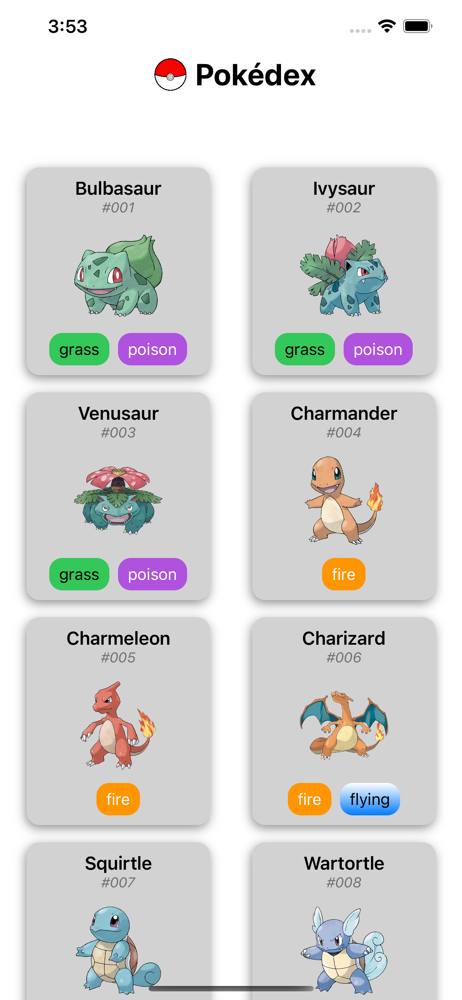
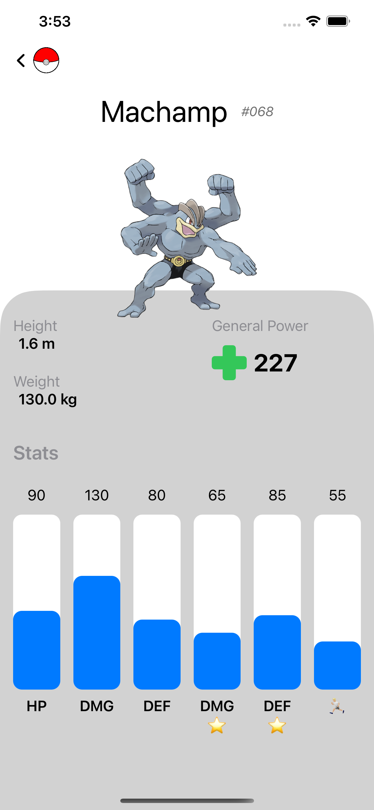
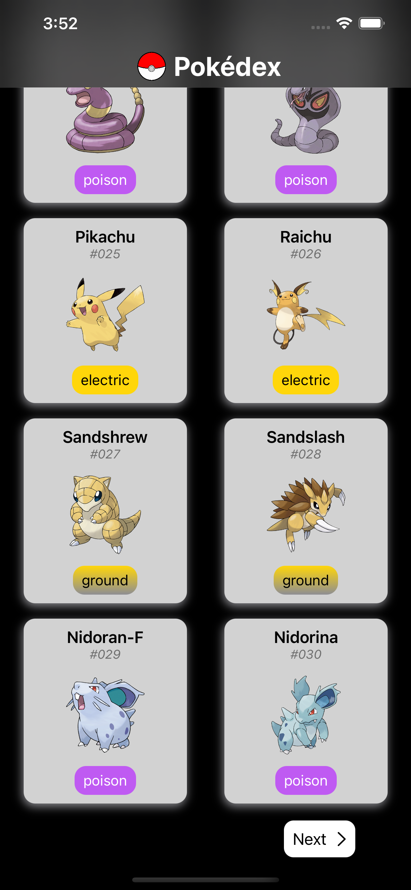
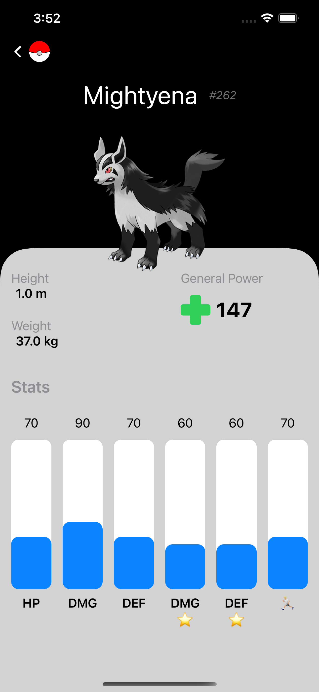

---

<

/>

Pokedex Application using **SwiftUI**/**PokeAPI**.

| Light Menu Screen          | Light Detail Screen        |
| -------------------------- | -------------------------- |
|          |        |

| Dark Menu Screen           | Dark Detail Screen         |
| -------------------------- | -------------------------- |
|           |         |

## Feature

- Use SwiftUI fully.
- Compatible with DarkMode.
- Support iPad (Full Screen) and all phones from iPhone 8.

## Dependencies

- [SwiftUI](https://developer.apple.com/xcode/swiftui/)
- [PokeAPI](https://pokeapi.co/)
- [SwURL](https://github.com/cmtrounce/SwURL): Asyncrounously download and display images in Swift UI.

## License

**Pokedex** is under MIT license. See the [LICENSE](LICENSE) file for more info.
